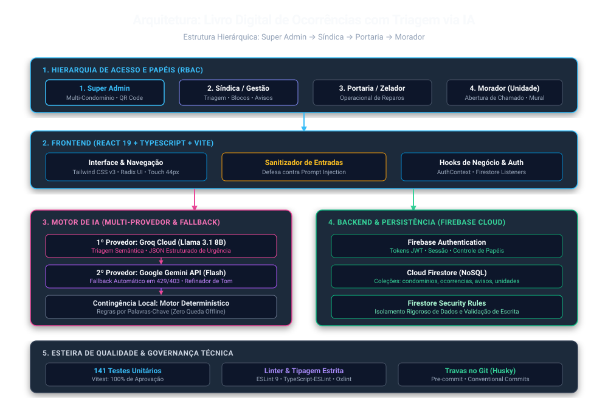
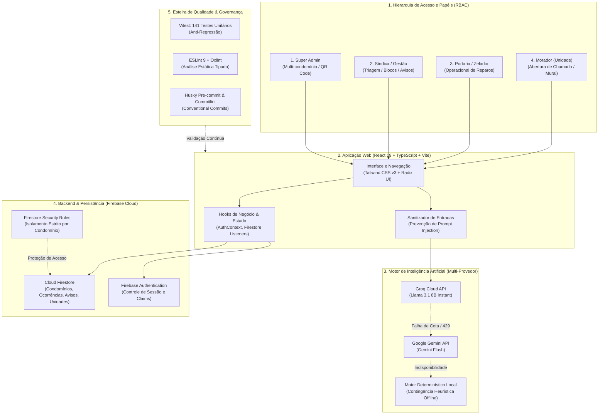

# Arquitetura do Sistema: Livro Digital de Ocorrências

Diagrama da arquitetura da aplicação para referência e apresentação no vídeo demonstrativo.

```mermaid
flowchart TD
    subgraph Acessos["1. Hierarquia de Acesso e Papéis (RBAC)"]
        SA["1. Super Admin<br/>(Multi-condomínio / QR Code)"]
        S["2. Síndica / Gestão<br/>(Triagem / Blocos / Avisos)"]
        Z["3. Portaria / Zelador<br/>(Operacional de Reparos)"]
        M["4. Morador (Unidade)<br/>(Abertura de Chamado / Mural)"]
    end

    subgraph Frontend["2. Aplicação Web (React 19 + TypeScript + Vite)"]
        UI["Interface e Navegação<br/>(Tailwind CSS v3 + Radix UI)"]
        SAN["Sanitizador de Entradas<br/>(Prevenção de Prompt Injection)"]
        HOOKS["Hooks de Negócio & Estado<br/>(AuthContext, Firestore Listeners)"]
    end

    subgraph CamadaIA["3. Motor de Inteligência Artificial (Multi-Provedor)"]
        GROQ["Groq Cloud API<br/>(Llama 3.1 8B Instant)"]
        GEMINI["Google Gemini API<br/>(Gemini Flash)"]
        FALLBACK["Motor Determinístico Local<br/>(Contingência Heurística Offline)"]
    end

    subgraph Backend["4. Backend & Persistência (Firebase Cloud)"]
        AUTH["Firebase Authentication<br/>(Controle de Sessão e Claims)"]
        DB["Cloud Firestore<br/>(Condomínios, Ocorrências, Avisos, Unidades)"]
        RULES["Firestore Security Rules<br/>(Isolamento Estrito por Condomínio)"]
    end

    subgraph Qualidade["5. Esteira de Qualidade & Governança"]
        TESTS["Vitest: 141 Testes Unitários<br/>(Anti-Regressão)"]
        LINT["ESLint 9 + Oxlint<br/>(Análise Estática Tipada)"]
        HOOKS_GIT["Husky Pre-commit & Commitlint<br/>(Conventional Commits)"]
    end

    M & S & SA & Z --> UI
    UI --> SAN
    UI --> HOOKS
    
    SAN --> GROQ
    GROQ -.->|Falha de Cota / 429| GEMINI
    GEMINI -.->|Indisponibilidade| FALLBACK
    
    HOOKS --> AUTH
    HOOKS --> DB
    RULES -.->|Proteção de Acesso| DB

    Qualidade -.->|Validação Contínua| Frontend
```
